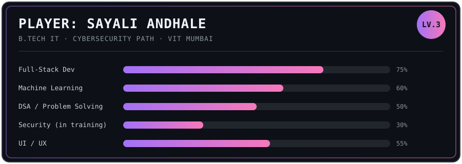

Still learning security properly, not just wearing the label. Everything else — build, ship, break, fix, repeat.

---

### ACTIVE QUESTS
- co-authoring an IEEE paper — *AI Hallucinations in Cyber Security Threat Detection* (InCoWoCo 2026)
- daily DSA grind in C++ — no zero days
- leveling up cybersecurity fundamentals from scratch

### COMPLETED QUESTS
| | |
|---|---|
| **fleet-telemetry-dashboard** | real-time fleet monitoring — live locations, telemetry, alerts |
| **internlink-vit** | internship discovery platform with a recommendation engine |
| **optisolve** | Simplex-method LP solver — OCR input, 2D/3D visualization |
| **multi-mode-reservation-system** | backend reservation engine — dynamic scheduling, seat allocation |

---

### INVENTORY

| | |
|---|---|
| Languages | Python · C++ · Java · JavaScript |
| Web | React · Vite · Flask · HTML/CSS |
| Data / ML | Pandas · NumPy · Scikit-learn |
| Databases | MySQL · SQLite |
| Tools | Git · Figma · Power BI |

---

### GUILD
B.Tech IT, Cybersecurity specialization — VIT Mumbai
Past runs: SAP (MM + PP), frontend dev, project management, content

---

**INSERT COIN TO CONTINUE**

`sayaliandhale70@gmail.com` &#183; [LinkedIn](https://www.linkedin.com/in/sayali-andhale-3207b2343/) &#183; [GitHub](https://github.com/Saaycodes)

